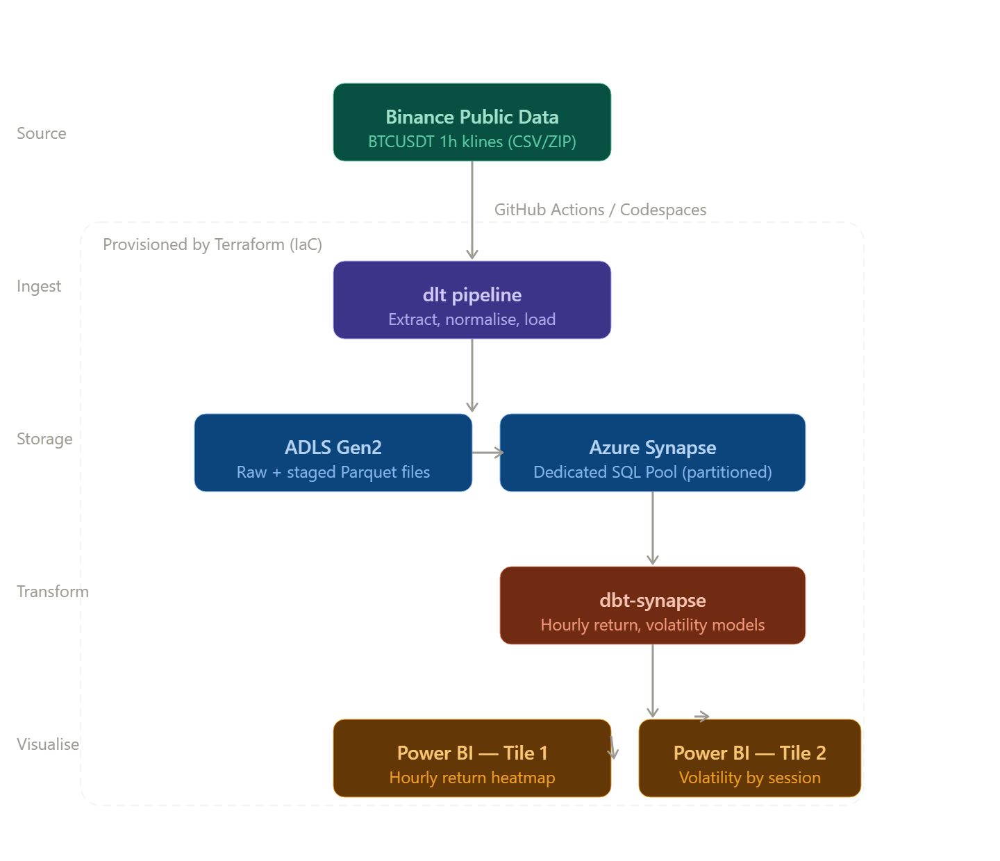

# Automated Intraday Pattern Mining for BTC/USDT

A high-performance data engineering pipeline designed to identify recurring, time-based price behaviors and volatility clusters in the BTC/USDT market.

## 📌 Project Overview
Markets are not random. The BTC/USDT pair exhibits distinct "intraday seasonality"—consistent bullish or bearish tendencies at specific hours—driven by regional session opens (Asia, Europe, and the US). 

This project automates the ingestion, transformation, and visualization of historical 1h kline data to answer:
* **Which specific hours** does BTC/USDT consistently rise or fall?
* **Which trading sessions** exhibit the highest volatility vs. liquidity?
* **How can traders exploit** these predictable temporal patterns?

## 🏗️ Architecture & Tech Stack
The project follows a Modern Data Stack (MDS) architecture deployed on **Microsoft Azure**.



* **Source:** [Binance Public Data](https://github.com/binance/binance-public-data/tree/master) (BTC/USDT 1h klines via `data.binance.vision`).
* **Ingestion:** `dlt` (Data Load Tool) running on GitHub Actions/Codespaces for automated extraction and schema normalization.
* **Storage:** **Azure Data Lake Storage (ADLS Gen2)** for raw Parquet files (Bronze/Silver layers).
* **Warehouse:** **Azure Synapse Analytics** (Dedicated SQL Pool) for high-performance analytical queries.
* **Transformation:** `dbt-synapse` to model hourly average returns, session-based volatility, and buy/sell pressure ratios.
* **Infrastructure:** **Terraform** for reproducible Infrastructure as Code (IaC) of all Azure resources.
* **Visualization:** **Power BI** dashboard featuring hourly return heatmaps and session volatility metrics.

## 🎯 Problem Statement
The 24/7 nature of the Bitcoin market creates a **signal-to-noise problem**. Most traders apply static strategies regardless of the time of day, ignoring that a move at 04:00 UTC (Asian Session) has different liquidity and volume characteristics than the same move at 14:00 UTC (US Open). 

**Intraday Pattern Mining for BTC/USDT** solves this by:
1.  **Bridging the Context Gap:** Providing "Time-of-Day" analytics that lagging indicators (RSI/MACD) miss.
2.  **Optimizing Execution:** Identifying "Golden Hours" of volatility to reduce slippage and improve entry timing.
3.  **Automating Research:** Replacing manual CSV analysis with a scalable, cloud-native SQL pipeline.

## 🚀 Key Insights Provided
* **Hourly Expected Value (EV):** The mean return for each of the 24 hours in a day across multi-year datasets.
* **Session Volatility Profiles:** Comparative analysis of range expansion across Asian, European, and US trading windows.
* **Regional Handover Deltas:** Tracking price behavior during the "power hour" overlaps between major global financial hubs.

## 🛠️ Performance Optimization
To ensure the project remains cost-effective and performant within Azure Synapse:
* **Partitioning:** Tables are partitioned by **Month** to optimize historical lookbacks.
* **Clustering:** Data is clustered by **Hour** to accelerate time-series mining queries.
* **Parquet Storage:** Using columnar storage in ADLS Gen2 to minimize I/O and storage costs.


## ⚙️ Data Ingestion

### Overview
Data is ingested from [Binance's public data archive](https://data.binance.vision) using a custom Python pipeline (`binance_ingest.py`) built on top of [dlt (Data Load Tool)](https://dlthub.com). The pipeline downloads monthly BTCUSDT 1h kline zip files, parses and cleans them, and loads them directly into Azure Synapse Analytics via `INSERT INTO ... SELECT ... UNION` statements.

**Key design decisions:**
- `write_disposition="merge"` with `primary_key="open_time"` ensures re-runs are safe — no duplicate candles.
- Timestamps are converted to Python `datetime` objects (maps to `DATETIME2` in Synapse) to avoid `NVARCHAR(MAX)` type issues.
- Binance changed SPOT timestamps from milliseconds to microseconds from January 2025 onwards — the pipeline auto-detects the unit per file.
- `loader_file_format = "insert_values"` with `batch_size = 50` is used to stay within Synapse's 32,500 literal-per-query limit.
- Each month is loaded through its own isolated pipeline call so any failure is visible immediately without affecting other months.

### Schema loaded into Synapse
Table: `gold_btc_data.btcusdt_1h_klines`

| Column | Type | Description |
|---|---|---|
| `open_time` | DATETIME2 | Candle open timestamp (primary key) |
| `open` | FLOAT | Opening price |
| `high` | FLOAT | Highest price in period |
| `low` | FLOAT | Lowest price in period |
| `close` | FLOAT | Closing price |
| `volume` | FLOAT | Base asset volume (BTC) |
| `close_time` | DATETIME2 | Candle close timestamp |
| `quote_volume` | FLOAT | Quote asset volume (USDT) |
| `count` | BIGINT | Number of trades |
| `taker_buy_base` | FLOAT | Taker buy base asset volume |
| `taker_buy_quote` | FLOAT | Taker buy quote asset volume |

### dlt configuration

`.dlt/config.toml` (committed — no secrets):
```toml
[runtime]
batch_size = 50

[load]
loader_file_format = "insert_values"
```

`.dlt/secrets.toml` (gitignored — never commit):
```toml
[destination.synapse]
credentials = "synapse://<user>:<password>@<workspace>.sql.azuresynapse.net:1433/<pool>"
```

### Running the pipeline

**One-time historical backfill (2023-01-01 → present):**
```bash
python binance_ingest.py --mode backfill
```
Loads each month individually with its own pipeline call, printing a status line per month:
```
[INFO] Loading 2023-01 …
  [fetch] BTCUSDT-1h-2023-01.zip ... OK (744 rows)
============================================================
Pipeline binance_btcusdt_pipeline load step completed in 14.86 seconds
1 load package(s) were loaded to destination synapse and into dataset gold_btc_data
Load package 177xxx is LOADED and contains no failed jobs
============================================================
```

**Monthly incremental load (previous calendar month only):**
```bash
python binance_ingest.py --mode incremental
```

**Single month (for testing or reloading a specific month):**
```bash
python binance_ingest.py --mode single --year 2024 --month 6
```

**Dry run (fetch and parse without loading into Synapse):**
```bash
python binance_ingest.py --mode backfill --dry-run
```

## 🤖 Automated Monthly Scheduling (GitHub Actions)

The incremental load runs automatically on the **2nd of every month at 06:00 UTC** via GitHub Actions. The 2nd is chosen to allow Binance time to publish the previous month's complete archive (published on the 1st).

The workflow is defined in `.github/workflows/binance_incremental.yml`.

### How it works

Each run performs the following steps in a fresh Ubuntu environment:

1. **Checkout repository** — pulls the latest code from the `main` branch.
2. **Set up Python 3.12** — provisions the exact Python version used in development.
3. **Cache pip dependencies** — caches installed packages using a hash of `requirements.txt` so subsequent runs are faster.
4. **Install dependencies** — installs from `requirements.txt` using pinned versions (see below).
5. **Write dlt secrets** — injects the Synapse connection string from the GitHub repository secret `SYNAPSE_CONNECTION_STRING` into `.dlt/secrets.toml` at runtime. This file is never committed to the repo.
6. **Write dlt config** — writes `.dlt/config.toml` with `batch_size = 50` and `loader_file_format = "insert_values"` directly in the workflow so no config file needs to be committed.
7. **Run incremental ingest** — executes `python binance_ingest.py --mode incremental`, which fetches and loads the previous calendar month into Synapse.

### Triggering a manual run

1. Go to the repo → **Actions** tab
2. Select **Binance Monthly Incremental Ingest** in the left sidebar
3. Click **Run workflow** → **Run workflow**

The workflow logs show the same per-month status output as a local run.

### Setting up the GitHub Secret

The Synapse connection string must be stored as a repository secret — never hardcoded:

1. Go to repo → **Settings** → **Secrets and variables** → **Actions**
2. Click **New repository secret**
3. Name: `SYNAPSE_CONNECTION_STRING`
4. Value: your full Synapse connection string:
   ```
   synapse://<user>:<password>@<workspace>.sql.azuresynapse.net:1433/<pool>
   ```

### Troubleshooting: `pkg_resources` error

During initial setup, the GitHub Actions run failed with:

```
ModuleNotFoundError: No module named 'pkg_resources'
```

**Root cause:** `azure-cli` was included in `requirements.txt`. It pulls in over 100 transitive dependencies and caused pip to backtrack, resolving `dlt` all the way down to version `1.4.1`. That old version imports `pkg_resources` which is not available without `setuptools` being explicitly installed.

**Fix applied:**
- Removed `azure-cli` from `requirements.txt` entirely — it is not needed by the ingest script.
- Pinned `dlt==1.25.0` explicitly to prevent pip backtracking.
- Added `setuptools==80.10.2` explicitly as a safety net.

All versions in `requirements.txt` are now pinned to match the working local codespace venv exactly.

### `requirements.txt` (pinned working versions)

```txt
# Ingestion
dlt[synapse]==1.25.0
setuptools==80.10.2

# Azure auth & storage
azure-identity==1.25.3
azure-storage-blob==12.28.0

# Data handling
pandas==3.0.2
pyarrow==23.0.1
requests==2.33.1
pyodbc==5.1.0

# dbt transformation
dbt-core==1.8.0
dbt-synapse==1.8.4
dbt-fabric==1.9.3

# Utilities
python-dotenv
```

---

## 🛠️ Performance Optimisation
To ensure the project remains cost-effective and performant within Azure Synapse:
* **Partitioning:** Tables are partitioned by **Month** to optimise historical lookbacks.
* **Clustering:** Data is clustered by **Hour** to accelerate time-series mining queries.
* **Columnar storage:** Parquet in ADLS Gen2 minimises I/O and storage costs for staging.


---
*Developed as a project for Data Engineering Zoomcamp 2026 Project [DATATALKS CLUB](https://github.com/DataTalksClub).*


